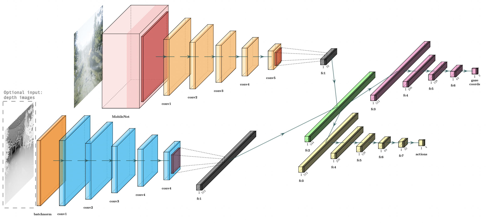

##     Gaze Regularized Imitation Learning:
### Learning Continuous Control from Human Gaze




The code is part of development of gaze regualrized imitation learning model for quadrotor to perform tasks like search and navigation autonomously. At present the repository contains implementation of GRIL with comparative algorithms like AGIL (see reference) and BC. The below image shows the gaze heatmap estimation and vecloity command prediction by the trained model.


### Requirements

The code has been tested on Ubuntu 18.04. The development environment is based on Python3 and Tensorflow 2.0+. This environment can be setup in a virtual environment using the requirements file included in the repository. After creating virtual environment, run the following. 
```bash
pip3 install -r requirements.txt
```

### Reference

Bera, Ritwik, et al. "[Gaze-Informed Multi-Objective Imitation Learning from Human Demonstrations.](https://arxiv.org/abs/2102.13008)" arXiv preprint arXiv:2102.13008 (2021)


