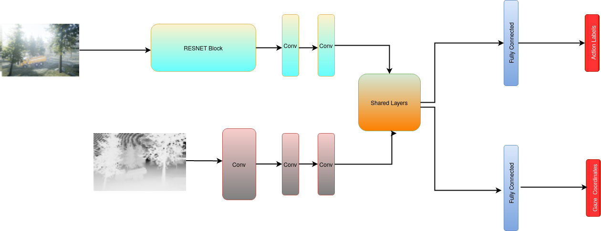

## Learning Visual Search and Navigation Task Using Human Gaze




The code is part of development of regualrized imitation learning model for developing UAS to perform autonomous tasks like search and navigation. At present the repository contains implementation of AGIL (see reference). The below image shows the gaze heatmap estimation and vecloity command prediction by the trained model.


### Requirements

The code has been tested on Ubuntu 18.04. The development environment is based on Python3 and Tensorflow 2.0+. This environment can be setup in a virtual environment using the requirements file included in the repository. After creating virtual environment, run the following. 
```bash
pip3 install -r requirements.txt
```

### Reference
Zhang, Ruohan, et al. "[Agil: Learning attention from human for visuomotor tasks.](https://openaccess.thecvf.com/content_ECCV_2018/html/Ruohan_Zhang_AGIL_Learning_Attention_ECCV_2018_paper.html)" Proceedings of the european conference on computer vision (eccv). 2018
