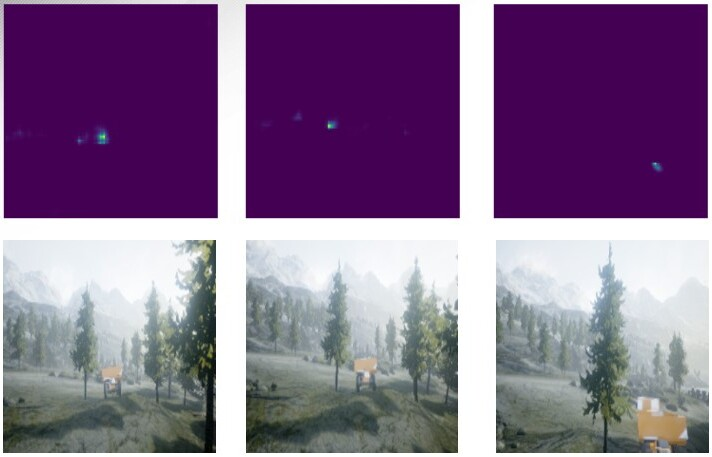

## Learning Visual Search and Navigation Task Using Human Gaze

The code is part of development of regualrized imitation learning model for developing UAS to perform autonomous tasks like search and navigation. At present the repository contains implementation of AGIL (see reference). The below image shows the gaze heatmap estimation and vecloity command prediction by the trained model.




### Requirements

The code has been tested on Ubuntu 18.04. Python3 and Keras are required. Relevant python libraries can installed (inside virtual environment) using: 
```bash
pip3 install -r requirements.txt
```

### Reference
Zhang, Ruohan, et al. "[Agil: Learning attention from human for visuomotor tasks.](https://openaccess.thecvf.com/content_ECCV_2018/html/Ruohan_Zhang_AGIL_Learning_Attention_ECCV_2018_paper.html)" Proceedings of the european conference on computer vision (eccv). 2018
