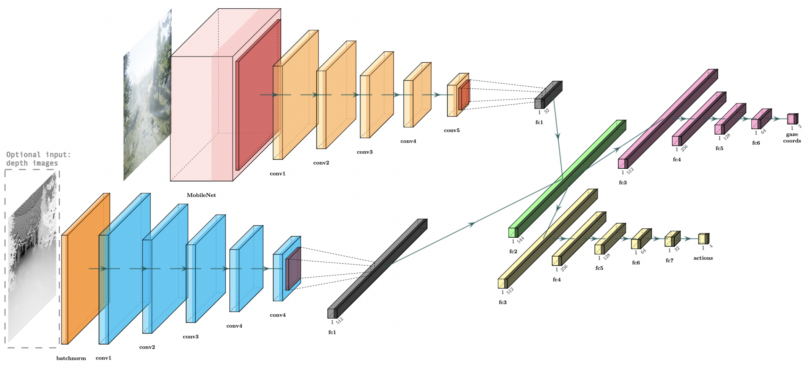

##     Gaze Regularized Imitation Learning:
### Learning Continuous Control from Human Gaze

This repository contains the implementation of gaze-regularized imitation learning for autonomous quadrotor control. The trained models follow a yellow truck on predefined paths, using RGB+Depth sensing and human gaze for attention guidance. The GIF below shows GRIL's generalization on a moving target scenario.

### Reference

[Imitation Learning with Human Eye Gaze via Multi-Objective Prediction](https://openreview.net/pdf?id=MF1Tcmk2YB) ILHF Workshop ICML 2023 
Video: [Quadrotor following a moving truck](https://www.youtube.com/watch?v=vFiT293FR1Q)

